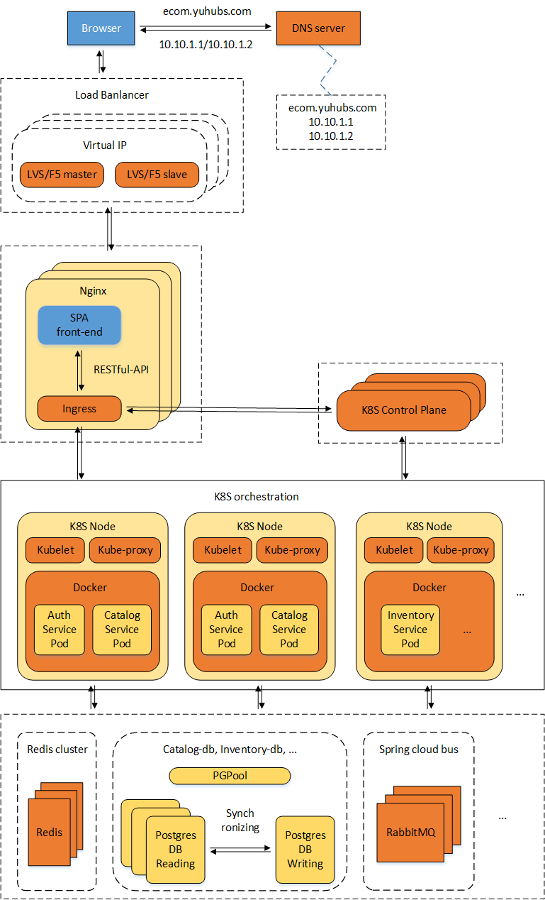

# Microservices Project Starter

The project is as starter to build microservices-oriented architecture applications, aimed as:
* Using the best practices for building microservices project.
* Scaling for serving up to millions of concurrent accesses.
* Deploying from a standalone server to public cloud platform cluster.
* High-Available for each cluster component.

This starter uses eCommerce store supportive app as the demonstration.

## Project directory structure

* auth - Security supports, based on spring-security and JWT (json web token).
* certs - Configure and generate the certificates for app components.
* commons - Common libs for building RESTful-API, reactive, high-performance, spring-framework based services.
* docker - Set up docker supporting images and containers.
* front-end - The web front-end for app, a SPA based on ReactJS, react-redux, redux-saga, Material-UI, etc.
* k8s - (Coming soon) Set up kubernetes components and resource-objects.
* services - Home for project services.
* utils - Project utilities.

## Architecture

### Prerequisites

* [JDK 8](https://www.oracle.com/java/technologies/javase-jdk8-downloads.html)
* [Apache Maven](https://maven.apache.org/)
* [Node JS](https://nodejs.org/en/download/)
* [Docker](https://docs.docker.com/engine/install/)

## Authors

* **Zhaoping Yu** - *Initial work* - yuzhaoping1970@gmail.com

## License

This project is licensed under the MIT License - see the [LICENSE](LICENSE) file for details
