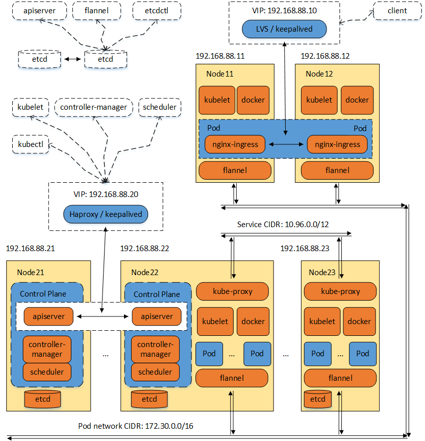

# Setting up a distributed Kubernetes cluster

Following the one directive file (DEPLOY.variables) to set up a distributed Kubernetes cluster. You could adjust cluster nodes deployment scheme and/or tweak kubernetes components' configuration, simply and flexibility.

* Deploy etcd to multiple nodes as high availability cluster.
* Deploy kube-apiserver to multiple nodes as high availability cluster (with haproxy and keepalived).
* Set up kube-controller-manager, kube-scheduler as highly available clusters.
* Disable all components' insecure ports, components communicate with each other by secure ports.
* Comply with the strict authentication and authorization policy (x509, token-auth, RBAC), disable anonymous auth.
* Enable kubelet TLS bootstrapping and certificate rotation.
* Set up kube-proxy with the ipvs mode.
* Running kubernetes services with non-root user.
* In accordance with the kubeadm conventions and best practices.

Using Packer and Vagrant to build and manage VirtualBox vagrant boxes for local distribution.

## Directory structure

* addons - The kubernetes addon components' deploying configurations and resources.
* build - The generated temporary directory for built and deployed targets.
* components - The kubernetes core (along with relative) components' deploying service and configuration files.
* _deploy - Assisted deployment scrits.
* packer - To build machine images (VirtualBox, etc) for kubernetes started binaries and environments.
* pki - To generate and deploy PKI certificates, according to the [PKI best practices](https://kubernetes.io/docs/setup/best-practices/certificates/).
* provisions - Shell scripts for install, startup and shutdown kubernetes components and services.
* vagrant - To deploy vagrant files for local distribution.

## Architecture



## Usage

### Prerequisites (Optional)

* [HashiCorp Packer](https://www.packer.io/downloads/)
* [Oracle VirtualBox](https://www.virtualbox.org/wiki/Downloads)
* [HashiCorp Vagrant](https://www.vagrantup.com/downloads.html)

### Set up

First, edit the DEPLOY.variables file to adjust the deployment options, if any.

Build and deploy required PKI certificates:

```
./pki/deploy-all.sh
```

Deploy kubernetes core (along with relative) components' service and configuration files:

```
./components/deploy-all.sh
```

Deploy kubernetes addon components' configuration and resource files:

```
./addons/deploy-all.sh
```

Deploy kubernetes components and services' install, startup and shutdown provision scripts:

```
./provisions/deploy-all.sh
```

Finally, build the distribution machine images.

For local distribution, build the kubernetes started debian VirtualBox image (if haven't built):
```
./build-virtualbox-box.sh
```

Then, add the VirtualBox image as vagrant box (if haven't added):
```
./add-vagrant-box.sh
```

Deploy the vagrant files:
```
./vagrant/deploy-all.sh
```

### NOTE:
All of the built and deployed results are putting in the ./build directory.
